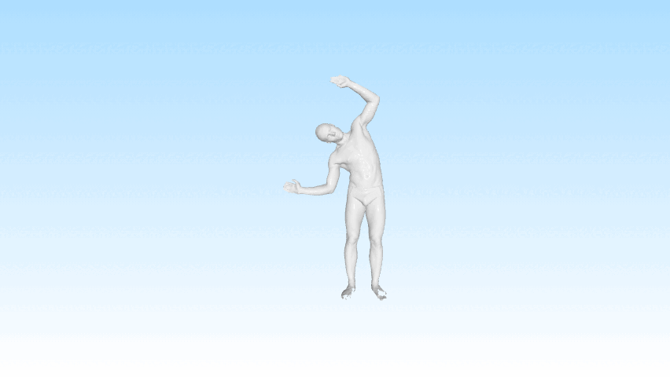
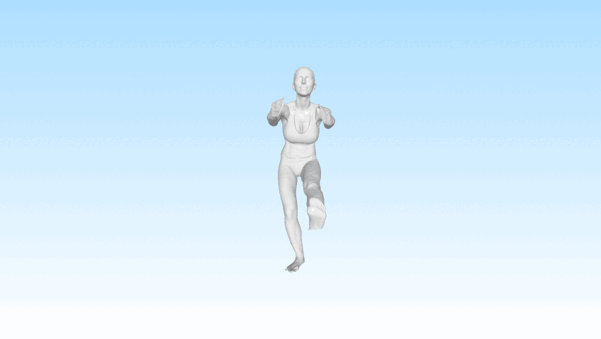
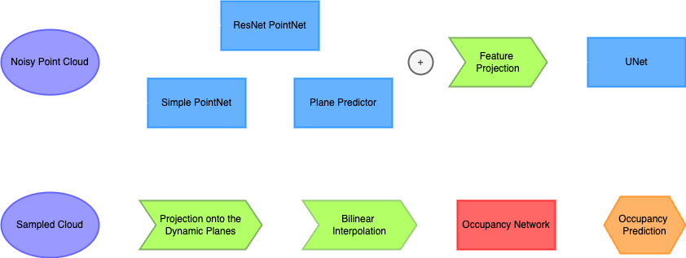

# Point Cloud Occupancy with Dynamic Planes

This Repository contains code for reconstructing 3D point clouds using the Occupancy Predictions of a small and sparse subsets of points.
This work is based on *Lionar, Stefan, et al. "**Dynamic Plane Convolutional Occupancy Networks**" Proceedings of the IEEE/CVF Winter Conference of Applications of Computer Vision, 2021* with <code style="color : GreenYellow">FAUST Dataset</code>.

<table>
  <tr>
    <td>
      
    </td>
    <td>
      
    </td>
  </tr>
</table>

## Table of Contents
- [Repository-Structure](#repository-structure)
- [Installation](#installation)
- [Dataset](#dataset)
- [Architecture](#architecture)

## Repository Structure
```plaintext
PointCloud3D/
├── README.md
├── requirements.txt
├── PointCloud3D.ipynb
├── .gitignore
├── Media/
│    └── images
│
├── Src/
│    ├── dataset.py
│    ├── encoder.py
│    ├── plane_predictor.py
│    ├── unet.py
│    └── utils.py
│    
├── Papers/
│    ├── dynamic_plane_conv.pdf
│    └── occupancy_net_mise.pdf
│
└── Slides/
     ├── main.pdf
     └── main.tex
```

## Installation

1. Clone the repository:
   ```bash
   git clone https://github.com/EugenioBugli/3DPointCloud.git
2. Install dependencies:
    ```bash
    pip install -r <Folder>/3DPointCloud/requirements.txt
3. You can run the Code directly from the [Notebook](PointCloud3D.ipynb)

## Dataset
<code style="color : GreenYellow">FAUST Dataset</code> 

## Architecture

The Architecture used has an Encoder-Decoder structure and takes a Noisy Cloud as input for the Encoder and a Sampled Cloud for the Decoder.

- **Noisy Cloud**: it's composed by 3000 points sampled over the surface of the starting mesh with the addition of Gaussian noise.

- **Sampled Cloud**: it's composed by 2048 points sampled over the bounding box containing the starting mesh.

During Training we use Binary Cross Entropy (<code style="color : GreenYellow">BCE</code>) between the occupancy prediction and the ground truth occupancy, while during Inference we Multiresolution IsoSurface Extraction (<code style="color : GreenYellow">MISE</code>) to reconstruct the meshes.

