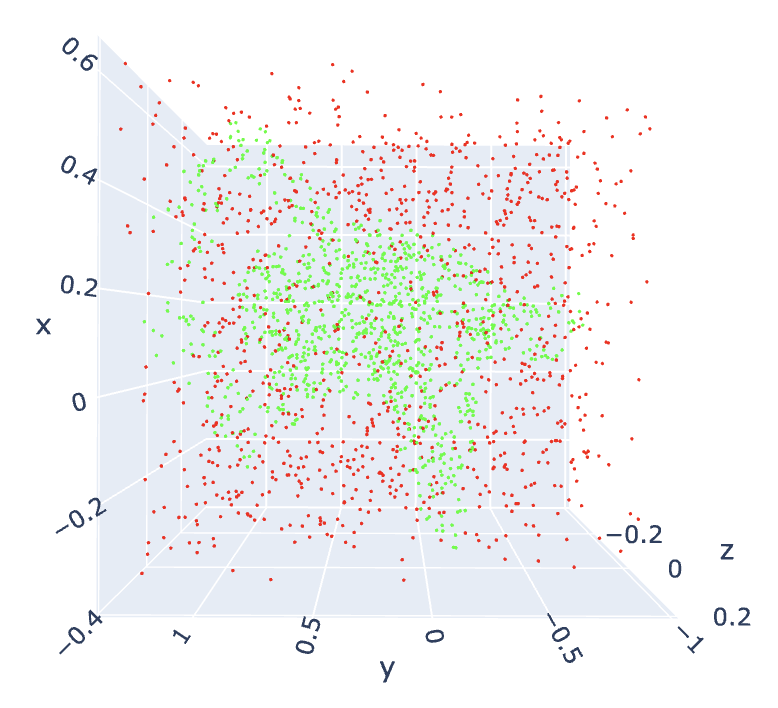

# Point Cloud Occupancy with Dynamic Planes

This Repository contains code for reconstructing 3D point clouds using the Occupancy Predictions of a small and sparse subsets of points.
This work is based on *Lionar, Stefan, et al. "**Dynamic Plane Convolutional Occupancy Networks**" Proceedings of the IEEE/CVF Winter Conference of Applications of Computer Vision, 2021* with <font color="gold">FAUST Dataset</font>.

<table>
  <tr>
    <td>
      
    </td>
    <td>
      
    </td>
  </tr>
</table>

## Table of Contents
- [Repository-Structure](#repository-structure)
- [Installation](#installation)
- [Dataset](#dataset)
- [Architecture](#architecture)
- [Reconstruction](#reconstruction)

## Repository Structure
```plaintext
PointCloud3D/
│
├── README.md
├── requirements.txt
├── PointCloud3D.ipynb
├── .gitignore
├── Media/
│    └── images
│
├── Src/
│    ├── dataset.py
│    ├── encoder.py
│    ├── plane_predictor.py
│    ├── unet.py
│    └── utils.py
│    
├── Papers/
│    ├── dynamic_plane_conv.pdf
│    └── occupancy_net_mise.pdf
│
└── Slides/
     ├── main.pdf
     └── main.tex
```

## Installation

1. Clone the repository:
   ```bash
   git clone https://github.com/EugenioBugli/3DPointCloud.git
2. Install dependencies:
    ```bash
    pip install -r <Folder>/3DPointCloud/requirements.txt
3. You can run the Code directly from the [Notebook](PointCloud3D.ipynb)

## Dataset

Here is an example of the original point cloud extracted from a registration : 


From the previous cloud, we obtain the Noisy Cloud by sampling points from the surface and by adding the following augmentations:

- Rotation
- Translation
- Scaling


The sampled cloud is obtained by sampling points inside the bounding box that contains the original mesh, while The labels have been generated by measuring the distance between the points and the surface of the original mesh.



## Architecture


The Architecture used has an Encoder-Decoder structure and takes a Noisy Cloud as input for the Encoder and a Sampled Cloud for the Decoder.

- <font color="mediumpurple">**Noisy Cloud**</font>: it's composed by 3000 points sampled over the surface of the starting mesh with the addition of Gaussian noise.

- <font color="mediumpurple">**Sampled Cloud**</font>: it's composed by 2048 points sampled over the bounding box containing the starting mesh.

During Training we use Binary Cross Entropy (<font color="gold">BCE</font>) between the occupancy prediction and the ground truth occupancy, while during Inference we Multiresolution IsoSurface Extraction (<font color="gold">MISE</font>) to reconstruct the meshes.

## Reconstruction

This procedure, which is used to reconstruct a mesh starting from points sampled inside the orginal bounding box, follows these steps :


1. The volumetric space is discretized at an <font color="cornflowerblue">Initial Resolution</font> and for all the points (corners) belonging to this grid, the occupancy is checked with our Network.

2. Given a voxel, if two adjacent grid points have a different occupancy value then we define it as <font color="forestgreen"> active </font>. These type of voxels will be the ones intersecating the mesh with the Marching Cubes Algorithm.

3. All the active voxels will be subdivided into 8 subvoxels

4. Check the new occupancy values of the grid points and go to (2)

5. Repeat this until the <font color="cornflowerblue">Final Resolution</font> is reached.

<table>
  <tr>
    <td>
      At this final resolution, we apply the <font color="gold">Marching Cubes algorithm</font> to extract an approximate isosurface : 
    </td>
    <td>
      
    </td>
  </tr>
</table>

${ p \in \mathbb{R}^3 \ | \ f_{θ}(p,x) = τ }$.
